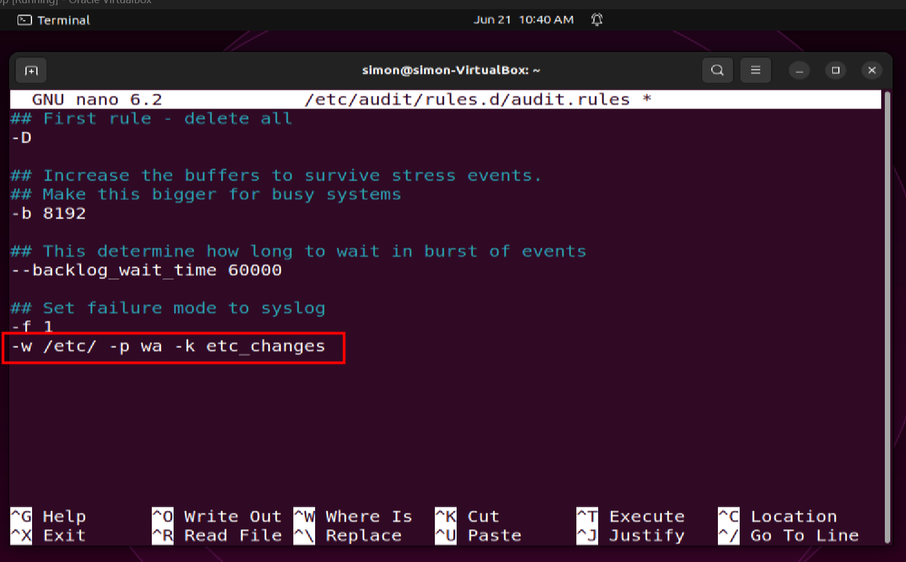
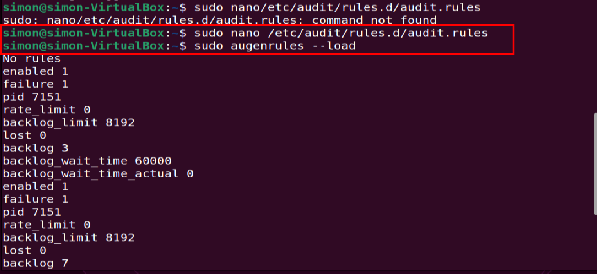
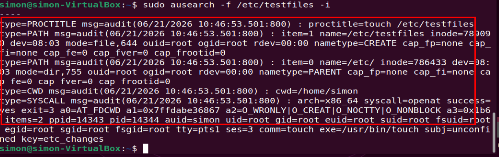
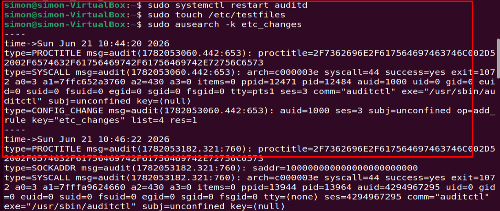

# Day 6 - File Integrity Monitoring with auditd

## Objective
Configure auditd to monitor `/etc/` for file writes + attribute changes and verify detection with forensic evidence.

## Lab Environment
- VirtualBox
- Ubuntu 24.04 
- auditd 4.0.3

## Commands Run

## 1. Add FIM rule to watch /etc/

sudo nano /etc/audit/rules.d/audit.rules

## Added:

-w /etc/ -p wa -k etc_changes

## 2. Load rules + restart auditd

sudo augenrules --load
sudo systemctl restart auditd

## 3. Test detection

sudo touch /etc/testfiles

## 4. Verify with ausearch

sudo ausearch -f /etc/testfiles -i

## Key Forensic Evidence

type=PATH msg=audit(06/21/2026 10:46:53.501:800) : name=/etc/testfiles nametype=CREATE mode=file,644 ouid=root
type=SYSCALL msg=audit(06/21/2026 10:46:53.501:800) : comm=touch exe=/usr/bin/touch uid=root key=etc_changes

## Important fields

1. :06/21/2026 10:46:53.501 - Timestamp of event
2. name=/etc/testfiles - File created in /etc/
3. nametype=CREATE - Action was file creation  
4. ouid=root comm=touch - Root user executed touch
5. key=etc_changes - Custom audit rule triggered

## Learning

Auditd provides metadata for FIM: who, what file, what action, when. It does NOT log file contents. For content changes, AIDE/Tripwire is needed next.

## My commitment: 

Showing up daily, building hands-on skills, and growing as a driven Blue Team engineer through consistency and ownership.
